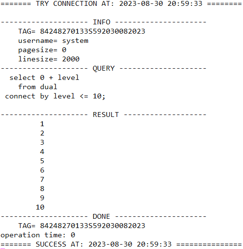
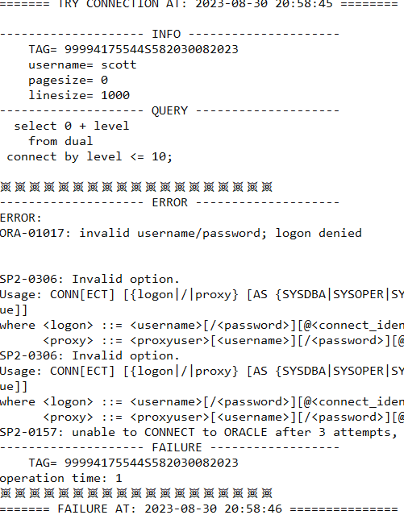

# Purpose

- 단순한 연동법으로 복잡한 절차 단순화(관심사를 쿼리작성과 결과값을 이용하는데에 집중하도록 분리)
- shell을 통해 연동한 정보 실시간 기록(접속정보, 쿼리정보, 성공/실패여부, 결과값)

# Sample

```shell
# 0. logging file(optional)
logging_directory="${MANAGER_PATH}/function_name/.log"
logging_file="${logging_directory}/$(echo $(date +%Y%m%d%H)).txt"
if [ ! -d logging_directory ]; then mkdir -p $logging_directory; fi
if [ ! -f logging_file ]; then touch $logging_file; fi

# 1. move manager_path
cd $MANAGER_PATH;
# 2. load profile
. loadProfile/loadProfile.sh system
# 3. ready query
query="
  select 0 + level
    from dual
 connect by level >= 10;  
"
# 4. execute
result=$(sh "executeQueryWithLog/executeQueryWithLog.sh" "$query" "when auto logging")
or
result=$(sh "executeQueryWithLog/executeQueryWithLog.sh" "$query" "when manual logging" "$logging_file")
# 5. echo
if [ $? -eq 0 ]
then
	LOG_INFO "$result"
	exit 0
else
	LOG_ERROR "$result"
	exit 1
fi
```
# Log

### SUCCESS



### FAILURE

> 설명: db 재설치하여 scott이라는 유저는 없는상태


