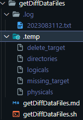
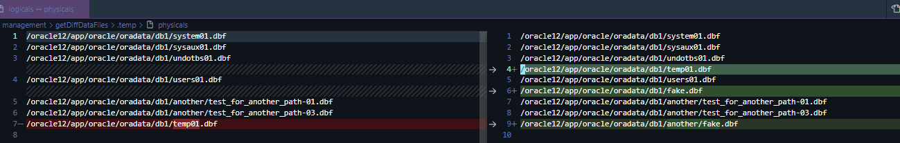

# Purpose

- datafile(tempfile 포함)의 누락/불필요 건들을 조회하기 위함
  - 💥 누락이 발견될 경우
    tablespace 또는 datafile의 유실에 대한 조치필요(일반적으로는 빠르게 offline하여 conflict 발생 제어)
  - 💎 불필요 발견될 경우
    
    파일시스템의 용량초과 이슈가 존재하지 않는 이상
    조치를 취하지 않아도 문제발생되지 않으므로
    여유롭게 직접 체크하고 정리필요한 시점에 제거하여 스토리지 절약✅
    
    > ref: `theory/dba/file/Datafile.md`

# Test

```sql
-- mkdir -p /oracle12/app/oracle/oradata/db1/another/
create tablespace test_for_another_path
         datafile '/oracle12/app/oracle/oradata/db1/another/test_for_another_path-01.dbf' size 1m,
                  '/oracle12/app/oracle/oradata/db1/another/test_for_another_path-02.dbf' size 1m,
                  '/oracle12/app/oracle/oradata/db1/another/test_for_another_path-03.dbf' size 1m;
                  
alter tablespace test_for_another_path drop datafile '/oracle12/app/oracle/oradata/db1/another/test_for_another_path-02.dbf';
rm /oracle12/app/oracle/oradata/db1/another/test_for_another_path-03.dbf
touch /oracle12/app/oracle/oradata/db1/another/fake.dbf
touch /oracle12/app/oracle/oradata/db1/fake.dbf
```
```sql
select 'data' as type, file_name, file_id
  from dba_data_files
 union all
select 'temp' as type, file_name, file_id
  from dba_temp_files
 order by type, file_id;
```

---

# Explain

1. shell 동작시 동일한 경로안에서 `.temp`와 `.log`디렉토리를 생성하고 각각의 목적에 따라 다음의 파일들을 생성한다.

   - `.temp`

     1. directories: 모든 datafile의 경로를 유니크하게 조회하여 기록하기 위한 파일
     2. logicals: 논리적인 모든 datafile을 기록하기 위한 파일
     3. physicals: directories안에 모든 `.dbf`를 기록하기 위한 파일
     4. delete_target: query 4 (physical - logical)
     5. missing_target: query 4 (logical - physical)
     6. delete_target_result: delete targets
     7. missing_target_result: missing targets
     8. commands_for_delete_target_result: command 4 delete targets
     9. commands_for_missing_target_result: command 4 missing targets

   - `.log`

     10. $(echo $(date +%Y%m%d%H)).txt: 분단위로 생성되는 로그파일이며, `executeQueryWithLog.sh `를 통해 쿼리실행시 모든 쿼리 내역을 저장한다.

     

   



---

# Result

### 1 .temp/directories

```shell
/oracle12/app/oracle/oradata/db1
/oracle12/app/oracle/oradata/db1/another
```

### 2 .temp/logicals

```shell
/oracle12/app/oracle/oradata/db1/system01.dbf
/oracle12/app/oracle/oradata/db1/sysaux01.dbf
/oracle12/app/oracle/oradata/db1/undotbs01.dbf
/oracle12/app/oracle/oradata/db1/users01.dbf
/oracle12/app/oracle/oradata/db1/another/test_for_another_path-01.dbf
/oracle12/app/oracle/oradata/db1/another/test_for_another_path-03.dbf
/oracle12/app/oracle/oradata/db1/temp01.dbf
```

### 3 .temp/physicals

```shell
/oracle12/app/oracle/oradata/db1/system01.dbf
/oracle12/app/oracle/oradata/db1/sysaux01.dbf
/oracle12/app/oracle/oradata/db1/undotbs01.dbf
/oracle12/app/oracle/oradata/db1/temp01.dbf
/oracle12/app/oracle/oradata/db1/users01.dbf
/oracle12/app/oracle/oradata/db1/fake.dbf
/oracle12/app/oracle/oradata/db1/another/test_for_another_path-01.dbf
/oracle12/app/oracle/oradata/db1/another/test_for_another_path-03.dbf
/oracle12/app/oracle/oradata/db1/another/fake.dbf
```

### 4 .temp/delete_target

```sql
select path from (select null as path from dual
 union all select '/oracle12/app/oracle/oradata/db1/system01.dbf' from dual
 union all select '/oracle12/app/oracle/oradata/db1/sysaux01.dbf' from dual
 union all select '/oracle12/app/oracle/oradata/db1/undotbs01.dbf' from dual
 union all select '/oracle12/app/oracle/oradata/db1/temp01.dbf' from dual
 union all select '/oracle12/app/oracle/oradata/db1/users01.dbf' from dual
 union all select '/oracle12/app/oracle/oradata/db1/fake.dbf' from dual
 union all select '/oracle12/app/oracle/oradata/db1/another/test_for_another_path-01.dbf' from dual
 union all select '/oracle12/app/oracle/oradata/db1/another/test_for_another_path-03.dbf' from dual
 union all select '/oracle12/app/oracle/oradata/db1/another/fake.dbf' from dual
) where path is not null
 minus
select path from (select null as path from dual
 union all select '/oracle12/app/oracle/oradata/db1/system01.dbf' from dual
 union all select '/oracle12/app/oracle/oradata/db1/sysaux01.dbf' from dual
 union all select '/oracle12/app/oracle/oradata/db1/undotbs01.dbf' from dual
 union all select '/oracle12/app/oracle/oradata/db1/users01.dbf' from dual
 union all select '/oracle12/app/oracle/oradata/db1/another/test_for_another_path-01.dbf' from dual
 union all select '/oracle12/app/oracle/oradata/db1/another/test_for_another_path-03.dbf' from dual
 union all select '/oracle12/app/oracle/oradata/db1/temp01.dbf' from dual
) where path is not null
;
```

### 5 .temp/missing_target

```shell
select path from (select null as path from dual
 union all select '/oracle12/app/oracle/oradata/db1/system01.dbf' from dual
 union all select '/oracle12/app/oracle/oradata/db1/sysaux01.dbf' from dual
 union all select '/oracle12/app/oracle/oradata/db1/undotbs01.dbf' from dual
 union all select '/oracle12/app/oracle/oradata/db1/users01.dbf' from dual
 union all select '/oracle12/app/oracle/oradata/db1/another/test_for_another_path-01.dbf' from dual
 union all select '/oracle12/app/oracle/oradata/db1/another/test_for_another_path-03.dbf' from dual
 union all select '/oracle12/app/oracle/oradata/db1/temp01.dbf' from dual
) where path is not null
 minus
select path from (select null as path from dual
 union all select '/oracle12/app/oracle/oradata/db1/system01.dbf' from dual
 union all select '/oracle12/app/oracle/oradata/db1/sysaux01.dbf' from dual
 union all select '/oracle12/app/oracle/oradata/db1/undotbs01.dbf' from dual
 union all select '/oracle12/app/oracle/oradata/db1/temp01.dbf' from dual
 union all select '/oracle12/app/oracle/oradata/db1/users01.dbf' from dual
 union all select '/oracle12/app/oracle/oradata/db1/fake.dbf' from dual
 union all select '/oracle12/app/oracle/oradata/db1/another/test_for_another_path-01.dbf' from dual
 union all select '/oracle12/app/oracle/oradata/db1/another/test_for_another_path-03.dbf' from dual
 union all select '/oracle12/app/oracle/oradata/db1/another/fake.dbf' from dual
) where path is not null
;
```

### 6 .temp/delete_target_result

```shell
/oracle12/app/oracle/oradata/db1/another/fake.dbf
/oracle12/app/oracle/oradata/db1/fake.dbf
```

### 7 .temp/missing_target_result

```shell
-
```

### 8 .temp/commands_for_delete_target_result

```shell
rm /oracle12/app/oracle/oradata/db1/another/fake.dbf;
rm /oracle12/app/oracle/oradata/db1/fake.dbf;
```

### 9 .temp/commands_for_missing_target_result

```shell
-
```

### 10 .log/$(echo $(date +%Y%m%d%H)).txt

```sql

======= TRY CONNECTION AT: 2023-08-31 12:45:28 ========
GET_UNIQUE_DIRECTORIES
-------------------- INFO ---------------------
    TAG= 03840547728S451231082023
    username= system
    pagesize= 0
    linesize= 2000
-------------------- QUERY --------------------
  select distinct substr(file_name, 1, instr(file_name, '/', -1) - 1) as datafile_directory
    from (select 'data' as type, file_name, file_id
            from dba_data_files
           union all
          select 'temp' as type, file_name, file_id
            from dba_temp_files
           order by type, file_id);
  
-------------------- RESULT -------------------
/oracle12/app/oracle/oradata/db1
/oracle12/app/oracle/oradata/db1/another
-------------------- DONE ---------------------
    TAG= 03840547728S451231082023
operation time: 0
======= SUCCESS AT: 2023-08-31 12:45:28 ===============

======= TRY CONNECTION AT: 2023-08-31 12:45:28 ========
GET_UNIQUE_DIRECTORIES
-------------------- INFO ---------------------
    TAG= 10506215128S451231082023
    username= system
    pagesize= 0
    linesize= 2000
-------------------- QUERY --------------------
  select file_name
    from (select 'data' as type, file_name, file_id
            from dba_data_files
           union all
          select 'temp' as type, file_name, file_id
            from dba_temp_files
           order by type, file_id);
  
-------------------- RESULT -------------------
/oracle12/app/oracle/oradata/db1/system01.dbf
/oracle12/app/oracle/oradata/db1/sysaux01.dbf
/oracle12/app/oracle/oradata/db1/undotbs01.dbf
/oracle12/app/oracle/oradata/db1/users01.dbf
/oracle12/app/oracle/oradata/db1/another/test_for_another_path-01.dbf
/oracle12/app/oracle/oradata/db1/another/test_for_another_path-03.dbf
/oracle12/app/oracle/oradata/db1/temp01.dbf
-------------------- DONE ---------------------
    TAG= 10506215128S451231082023
operation time: 0
======= SUCCESS AT: 2023-08-31 12:45:28 ===============

======= TRY CONNECTION AT: 2023-08-31 12:45:28 ========
GET_DELETE_TARGETS(PHYSICAL-LOGICAL)
-------------------- INFO ---------------------
    TAG= 18009737928S451231082023
    username= system
    pagesize= 0
    linesize= 2000
-------------------- QUERY --------------------
select path from (select null as path from dual
 union all select '/oracle12/app/oracle/oradata/db1/system01.dbf' from dual
 union all select '/oracle12/app/oracle/oradata/db1/sysaux01.dbf' from dual
 union all select '/oracle12/app/oracle/oradata/db1/undotbs01.dbf' from dual
 union all select '/oracle12/app/oracle/oradata/db1/temp01.dbf' from dual
 union all select '/oracle12/app/oracle/oradata/db1/users01.dbf' from dual
 union all select '/oracle12/app/oracle/oradata/db1/fake.dbf' from dual
 union all select '/oracle12/app/oracle/oradata/db1/another/test_for_another_path-01.dbf' from dual
 union all select '/oracle12/app/oracle/oradata/db1/another/test_for_another_path-03.dbf' from dual
 union all select '/oracle12/app/oracle/oradata/db1/another/fake.dbf' from dual
) where path is not null
 minus
select path from (select null as path from dual
 union all select '/oracle12/app/oracle/oradata/db1/system01.dbf' from dual
 union all select '/oracle12/app/oracle/oradata/db1/sysaux01.dbf' from dual
 union all select '/oracle12/app/oracle/oradata/db1/undotbs01.dbf' from dual
 union all select '/oracle12/app/oracle/oradata/db1/users01.dbf' from dual
 union all select '/oracle12/app/oracle/oradata/db1/another/test_for_another_path-01.dbf' from dual
 union all select '/oracle12/app/oracle/oradata/db1/another/test_for_another_path-03.dbf' from dual
 union all select '/oracle12/app/oracle/oradata/db1/temp01.dbf' from dual
) where path is not null
;
-------------------- RESULT -------------------
/oracle12/app/oracle/oradata/db1/another/fake.dbf
/oracle12/app/oracle/oradata/db1/fake.dbf
-------------------- DONE ---------------------
    TAG= 18009737928S451231082023
operation time: 0
======= SUCCESS AT: 2023-08-31 12:45:28 ===============

======= TRY CONNECTION AT: 2023-08-31 12:45:28 ========
GET_MISSING_TARGETS(LOGICAL-PHYSICAL)
-------------------- INFO ---------------------
    TAG= 25108480328S451231082023
    username= system
    pagesize= 0
    linesize= 2000
-------------------- QUERY --------------------
select path from (select null as path from dual
 union all select '/oracle12/app/oracle/oradata/db1/system01.dbf' from dual
 union all select '/oracle12/app/oracle/oradata/db1/sysaux01.dbf' from dual
 union all select '/oracle12/app/oracle/oradata/db1/undotbs01.dbf' from dual
 union all select '/oracle12/app/oracle/oradata/db1/users01.dbf' from dual
 union all select '/oracle12/app/oracle/oradata/db1/another/test_for_another_path-01.dbf' from dual
 union all select '/oracle12/app/oracle/oradata/db1/another/test_for_another_path-03.dbf' from dual
 union all select '/oracle12/app/oracle/oradata/db1/temp01.dbf' from dual
) where path is not null
 minus
select path from (select null as path from dual
 union all select '/oracle12/app/oracle/oradata/db1/system01.dbf' from dual
 union all select '/oracle12/app/oracle/oradata/db1/sysaux01.dbf' from dual
 union all select '/oracle12/app/oracle/oradata/db1/undotbs01.dbf' from dual
 union all select '/oracle12/app/oracle/oradata/db1/temp01.dbf' from dual
 union all select '/oracle12/app/oracle/oradata/db1/users01.dbf' from dual
 union all select '/oracle12/app/oracle/oradata/db1/fake.dbf' from dual
 union all select '/oracle12/app/oracle/oradata/db1/another/test_for_another_path-01.dbf' from dual
 union all select '/oracle12/app/oracle/oradata/db1/another/test_for_another_path-03.dbf' from dual
 union all select '/oracle12/app/oracle/oradata/db1/another/fake.dbf' from dual
) where path is not null
;
-------------------- RESULT -------------------

-------------------- DONE ---------------------
    TAG= 25108480328S451231082023
operation time: 0
======= SUCCESS AT: 2023-08-31 12:45:28 ===============
```

