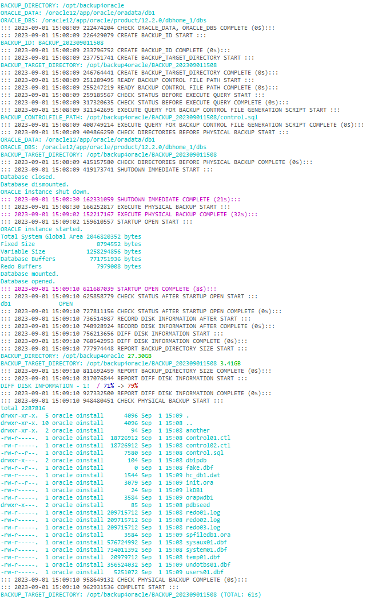

# offlineBackup


## flow

1. database 연동할 profile 불러오기
2. logging file 초기화
3. config file 읽기
4. config file을 통해 불러온 정보 검사
5. 백업ID 생성
6. 백업 경로 생성
7. controlfile 백업스크립트 백업 준비
8. controlfile 백업스크립트 백업전 status체크
9. controlfile 백업스크립트 백업 실행
10. shutdown immediate
11. TODO: physical backup
12. startup open

---

## log

### shell log



### sql log

```sql
========================================= TRY CONNECTION AT: 2023-09-01 15:08:09 =============
GET INSTANCE_NAME FOR FIND ORACLE_DATA_DIRECTORY_PATH
----------------------------------------- INFO #11097626309S081501092023 ---------------------
                                          username=system, pagesize=0, linesize=2000
----------------------------------------- QUERY ----------------------------------------------
select instance_name
  from v$instance;
----------------------------------------- RESULT ---------------------------------------------
db1
----------------------------------------- 0s #11097626309S081501092023 -----------------------
========================================= SUCCESS AT: 2023-09-01 15:08:09 ====================

========================================= TRY CONNECTION AT: 2023-09-01 15:08:09 =============
CHECK STATUS BEFORE EXECUTE QUERY
----------------------------------------- INFO #27212682309S081501092023 ---------------------
                                          username=system, pagesize=0, linesize=2000
----------------------------------------- QUERY ----------------------------------------------
select instance_name, status from v$instance;
----------------------------------------- RESULT ---------------------------------------------
db1		 OPEN
----------------------------------------- 0s #27212682309S081501092023 -----------------------
========================================= SUCCESS AT: 2023-09-01 15:08:09 ====================

========================================= TRY CONNECTION AT: 2023-09-01 15:08:09 =============
EXECUTE QUERY FOR BACKUP CONTROL FILE GENERATION SCRIPT
----------------------------------------- INFO #33433529109S081501092023 ---------------------
                                          username=system, pagesize=0, linesize=2000
----------------------------------------- QUERY ----------------------------------------------
alter database backup controlfile
to trace as '/opt/backup4oracle/BACKUP_202309011508/control.sql';
----------------------------------------- RESULT ---------------------------------------------

----------------------------------------- 0s #33433529109S081501092023 -----------------------
========================================= SUCCESS AT: 2023-09-01 15:08:09 ====================

========================================= TRY CONNECTION AT: 2023-09-01 15:08:09 =============
SHUTDOWN IMMEDIATE
----------------------------------------- INFO #43222778909S081501092023 ---------------------
                                          connection= / as sysdba, pagesize=0, linesize=2000
----------------------------------------- QUERY ----------------------------------------------
shutdown immediate;
----------------------------------------- RESULT ---------------------------------------------
Database closed.
Database dismounted.
ORACLE instance shut down.
----------------------------------------- 21s #43222778909S081501092023 -----------------------
========================================= SUCCESS AT: 2023-09-01 15:08:30 ====================

========================================= TRY CONNECTION AT: 2023-09-01 15:09:02 =============
STARTUP OPEN
----------------------------------------- INFO #17676803802S091501092023 ---------------------
                                          connection= / as sysdba, pagesize=0, linesize=2000
----------------------------------------- QUERY ----------------------------------------------
startup open;
----------------------------------------- RESULT ---------------------------------------------
ORACLE instance started.
Total System Global Area 2046820352 bytes
Fixed Size		    8794552 bytes
Variable Size		 1258294856 bytes
Database Buffers	  771751936 bytes
Redo Buffers		    7979008 bytes
Database mounted.
Database opened.
----------------------------------------- 8s #17676803802S091501092023 -----------------------
========================================= SUCCESS AT: 2023-09-01 15:09:10 ====================

========================================= TRY CONNECTION AT: 2023-09-01 15:09:10 =============
CHECK STATUS AFTER STARTUP OPEN
----------------------------------------- INFO #63887891810S091501092023 ---------------------
                                          username=system, pagesize=0, linesize=2000
----------------------------------------- QUERY ----------------------------------------------
select instance_name, status from v$instance;
----------------------------------------- RESULT ---------------------------------------------
db1		 OPEN
----------------------------------------- 0s #63887891810S091501092023 -----------------------
========================================= SUCCESS AT: 2023-09-01 15:09:10 ====================
```

