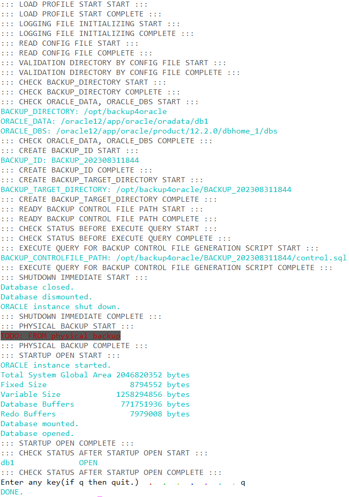

# offlineBackup

1. 실행시 화면

TODO: physical backup

## flow

1. database 연동할 profile 불러오기
2. logging file 초기화
3. config file 읽기
4. config file을 통해 불러온 정보 검사
5. 백업ID 생성
6. 백업 경로 생성
7. controlfile 백업스크립트 백업 준비
8. controlfile 백업스크립트 백업전 status체크
9. controlfile 백업스크립트 백업 실행
10. shutdown immediate
11. TODO: physical backup
12. startup open