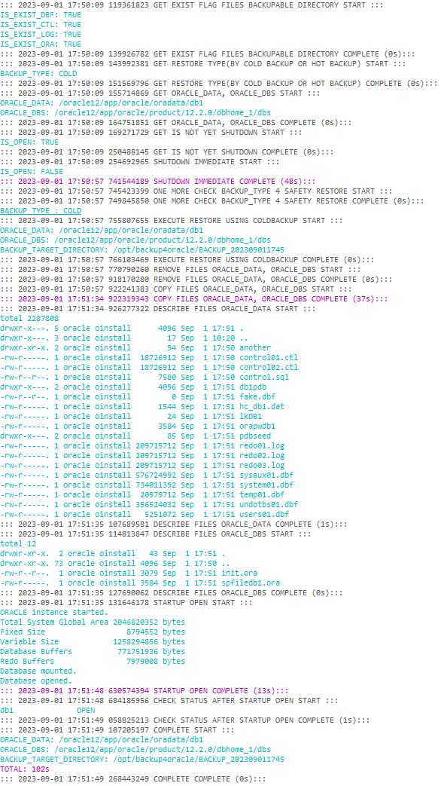

# offlineBackup

TOOD: 현재는 cold backup된 파일들만 offline full restore가 가능한 상태임.

## flow

TODO:

## log

### shell log



### sql log

```sql

========================================= TRY CONNECTION AT: 2023-09-01 17:50:09 =============
GET IS NOT YET SHUTDOWN
----------------------------------------- INFO #18267321809S501701092023 ---------------------
                                          username=system, pagesize=0, linesize=2000
----------------------------------------- QUERY ----------------------------------------------
select instance_name, status from v$instance;
----------------------------------------- RESULT ---------------------------------------------
db1		 OPEN
----------------------------------------- 0s #18267321809S501701092023 -----------------------
========================================= SUCCESS AT: 2023-09-01 17:50:09 ====================

========================================= TRY CONNECTION AT: 2023-09-01 17:50:09 =============
SHUTDOWN IMMEDIATE
----------------------------------------- INFO #26768836809S501701092023 ---------------------
                                          connection= / as sysdba, pagesize=0, linesize=2000
----------------------------------------- QUERY ----------------------------------------------
shutdown immediate;
----------------------------------------- RESULT ---------------------------------------------
Database closed.
Database dismounted.
ORACLE instance shut down.
----------------------------------------- 48s #26768836809S501701092023 -----------------------
========================================= SUCCESS AT: 2023-09-01 17:50:57 ====================

========================================= TRY CONNECTION AT: 2023-09-01 17:51:35 =============
STARTUP OPEN
----------------------------------------- INFO #19558813435S511701092023 ---------------------
                                          connection= / as sysdba, pagesize=0, linesize=2000
----------------------------------------- QUERY ----------------------------------------------
startup open;
----------------------------------------- RESULT ---------------------------------------------
ORACLE instance started.
Total System Global Area 2046820352 bytes
Fixed Size		    8794552 bytes
Variable Size		 1258294856 bytes
Database Buffers	  771751936 bytes
Redo Buffers		    7979008 bytes
Database mounted.
Database opened.
----------------------------------------- 13s #19558813435S511701092023 -----------------------
========================================= SUCCESS AT: 2023-09-01 17:51:48 ====================

========================================= TRY CONNECTION AT: 2023-09-01 17:51:48 =============
CHECK STATUS AFTER STARTUP OPEN
----------------------------------------- INFO #80362288848S511701092023 ---------------------
                                          username=system, pagesize=0, linesize=2000
----------------------------------------- QUERY ----------------------------------------------
select instance_name, status from v$instance;
----------------------------------------- RESULT ---------------------------------------------
db1		 OPEN
----------------------------------------- 1s #80362288848S511701092023 -----------------------
========================================= SUCCESS AT: 2023-09-01 17:51:49 ====================
```

